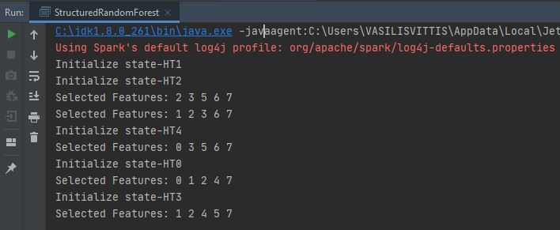
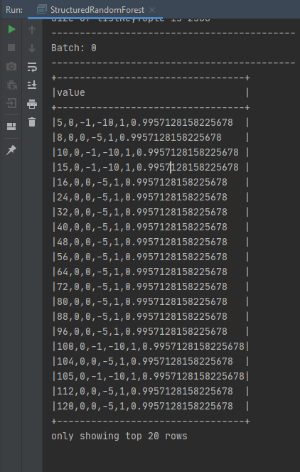
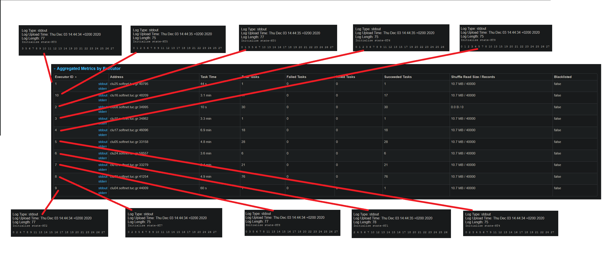

# [CCFD-RF] Credit Card Fraudulent Detection with Random Forest

This is a project for Credit Card Fraudulent Detection with Random Forest using Spark Structured Streaming

## In the code:
There are 3 options if you want to run CCFD-RF 
1. **Option 1:** Run job  _**locally**_, reading from a _**file**_ and writing to  _**console**_
2. **Option 2:** Run job  _**locally**_, reading from a  _**kafka source**_ and writing to a  _**kafka sink**_
3. **Option 3:** Run job  _**in SoftNet cluster**_, reading from  _**HDFS**_ and writing to  _**HDFS**_

**Notes:** <br>
_We propose to run the project with _**Option 2**_ because easier to test:_ <br>
_The attached code is written in Option 2_

## Configure SparkSession
### Option 1 & 2 Run locally:
<pre>
In line 25-30 [StructuredRandomForest]: Configure SparkSession variable
</pre>
```scala
    val spark = SparkSession.builder()
      .appName("SparkStructuredStreamingExample")
      .master("local[*]")
      .config("spark.sql.streaming.checkpointLocation", "checkpoint_saves/")
      .getOrCreate()
```
### Option 3 Run on the cluster:
<pre>
In line 25-30 [StructuredRandomForest]: Configure SparkSession variable
</pre>
```scala
    val spark = SparkSession.builder()
       .appName("SparkStructuredRandomForest")
       .config("spark.sql.streaming.checkpointLocation", "/user/vvittis")
       .getOrCreate()
```
## Read
### Option 1 Read from file:
<pre>
In line 35-43 [StructuredRandomForest]: Read from Source
</pre>
```scala
 val rawData = spark.readStream.text("dataset_source/")
```
### Option 2 Read from kafka:
<pre>
In line 35-43 [StructuredRandomForest]: Read from Source
</pre>
```scala
 val rawData = spark.readStream
          .format("kafka")
          .option("kafka.bootstrap.servers", "localhost:9092")
          .option("subscribe", "testSource")
          .option("startingOffsets", "earliest")
          .load()
          .selectExpr("CAST(value AS STRING)")
```
### Option 3 Read from an HDFS file:
<pre>
In line 35-43 [StructuredRandomForest]: Read from Source
</pre>
```scala
val rawData = spark.readStream.text("/user/vvittis/numbers")
```
_Note:_ **/user/vvittis/numbers is a path to a HDFS folder**

## Write
### Option 1 Write to console:
<pre>
In line 212 [StructuredRandomForest]: Write to Console
</pre>
```scala
  val query = kafkaResult.writeStream.outputMode("update").option("truncate", "false").format("console").queryName("TestStatefulOperator").start()
```
### Option 2 Write from kafka:
<pre>
In line 215-22 [StructuredRandomForest]: Write to kafka sink
</pre>
```scala
        val query = kafkaResult
          .selectExpr("CAST(value AS STRING)")
          .writeStream.outputMode("update")
          .format("kafka")
          .option("kafka.bootstrap.servers", "localhost:9092")
          .option("topic", "testSink")
          .queryName("RandomForest")
          .start()
```
### Option 3 Read from an HDFS file:
<pre>
In line 35-43 [StructuredRandomForest]: Read from Source
</pre>
```scala
        val rawData = spark.writeStream
            .output("append")
            .format("csv")
            .option("path","/user/vvittis/results/")          
            .queryName("RandomForest")
            .start()
```
_Note:_ **/user/vvittis/results is a path to a HDFS folder**
## RUN the project. 
### In Intellij 
<pre>
Step 1: Clone CCFD-RF File > New > Project From Version Control... 
Step 2: In the URL: copy https://github.com/vvittis/CCFD-RF.git 
        In the Directory: Add your preferred directory
Step 3: Click the build button or Build > Build Project
Step 4: Go to src > main > scala > StructuredRandomForest.scala and click Run
</pre>
* **A typical Console showing the state:**


* **A typical Console showing the output:**




### In Cluster 
* **A typical Cluster showing that each executor takes one Hoeffding Tree of the Random Forest:**
* This test executed with 10 executors and 10 HT.


 
Licensed under the [MIT Licence](LICENSE).

